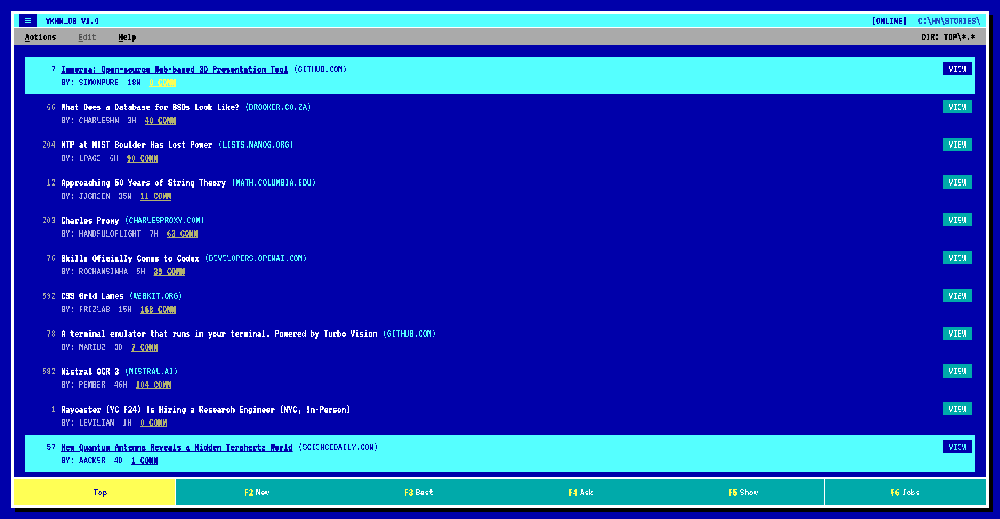

# YKHN

Retro terminal Hacker News client.

## Development

- `bun install`
- `bun run dev` (Vite @ `http://localhost:5173`)

## Keyboard shortcuts

- `?` toggle shortcuts overlay
- `Esc` close menus/help
- `F1..F6` switch feeds
- `j` / `k` move selection (list + comments)
- `gg` / `G` jump to top/bottom
- `[count]j` / `[count]k` / `[count]G` numeric prefix
- `zt` / `zz` / `zb` scroll active to top/center/bottom
- `Enter` / `d` open comments; `D` opens in new tab
- `o` open link; `O` opens in new tab
- `r` refresh current page
- `PgUp` / `PgDn` prev/next page or load more
- `Ctrl+o` / `Ctrl+i` browser back/forward
- `Ctrl+y` / `Ctrl+e` scroll one row
- `Ctrl+u` / `Ctrl+d` scroll half page
- `Ctrl+b` / `Ctrl+f` scroll full page

## License

MIT

