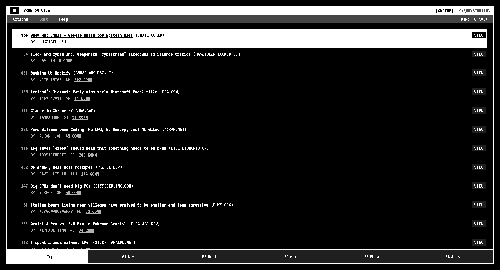
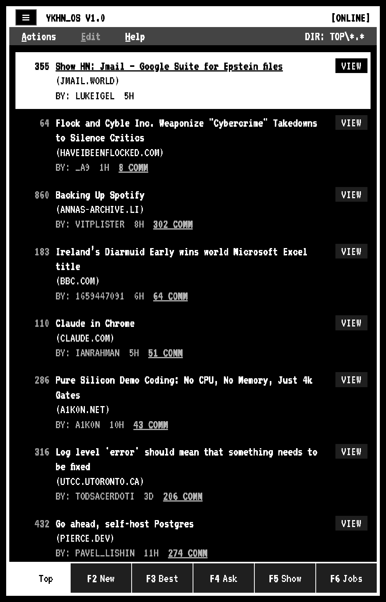
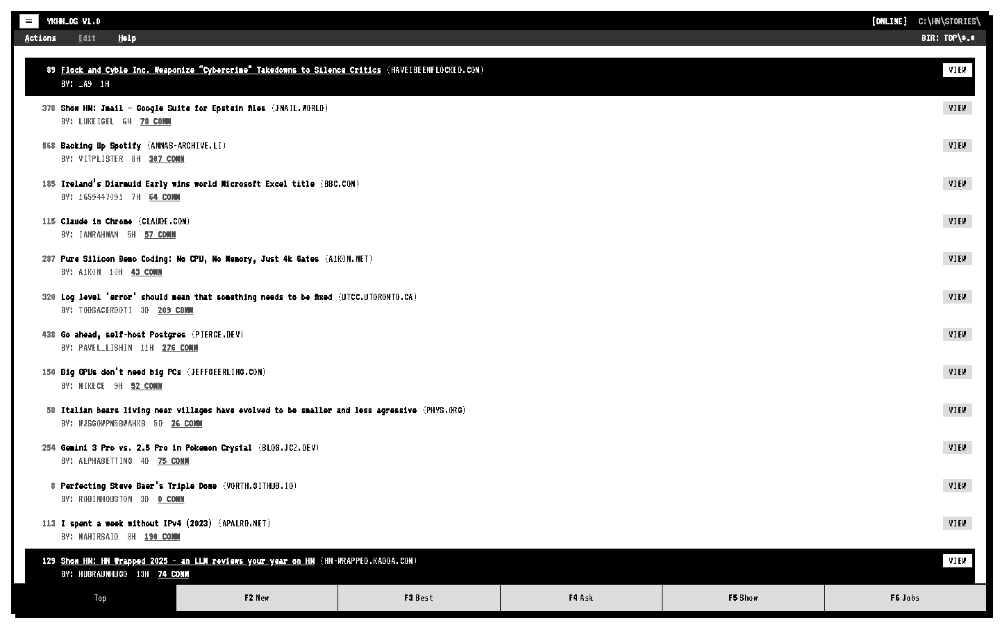
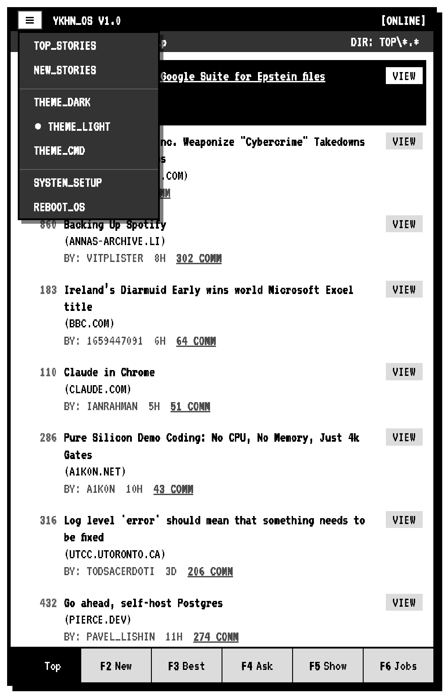
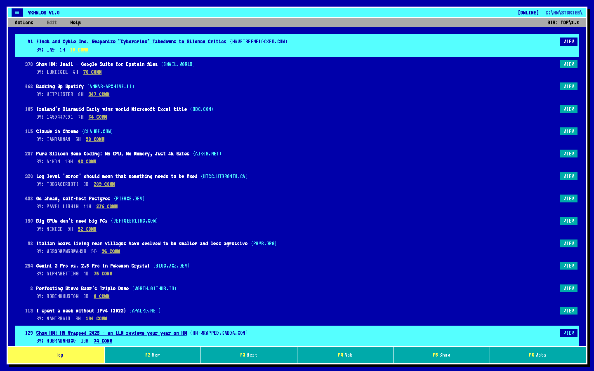
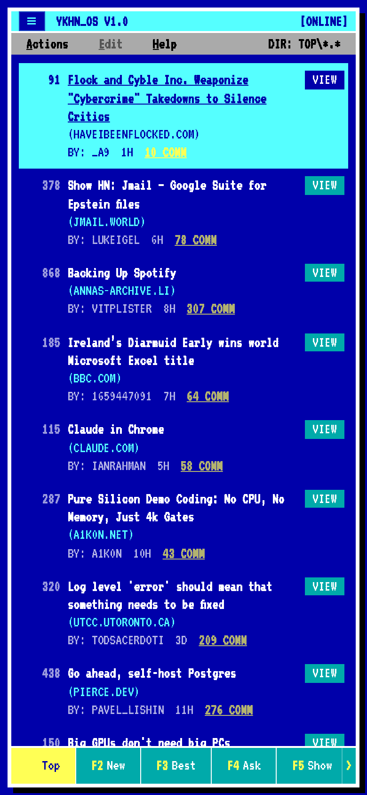

# YKHN

Retro terminal Hacker News client.

## Features

- **Feeds**: Top / New / Best / Ask / Show / Jobs.
- **Fast navigation**: keyboard-first UI with vim-style movement, count prefixes, and a `?` help overlay.
- **Story list**: select rows, open comments or the external link (same tab or new tab).
- **Item view**: story metadata + sanitized HTML, threaded comments with expand/collapse.
- **Progressive loading**: load more stories / comments; optional recursive comment prefetch.
- **State restore**: remembers scroll + selection per feed/item (session-based).
- **Themes & UI**: Commander/Dark/Light themes + adjustable font size.
- **Offline-friendly PWA**: installable, runtime-caches HN API responses, prompts when updates are available.

## Screenshots

| Theme | Desktop | Mobile |
| --- | --- | --- |
| Dark |  |  |
| Light |  |  |
| Commander |  |  |

## Development

- `bun install`
- `bun run dev` (Vite @ `http://localhost:5173`)

## Icons

Generate PWA icons from `public/pwa.svg`:

- `node scripts/render-icons.mjs`
- Rounded-corner variants (for iOS): `node scripts/render-icons.mjs --rounded`
- Custom radius / inset / background: `node scripts/render-icons.mjs --rounded --rounded-radius 0.22 --inset 0.10 --background "#fff"`

## Keyboard shortcuts

Shortcuts are ignored while typing in inputs.

**Global**

- `?` toggle shortcuts overlay
- `Esc` close menus/help
- `F1..F6` switch feeds
- `g1..g6` go to feed
- `[` / `]` prev/next feed
- `F9` open About / System Setup
- `r` refresh (current page action)
- `PgUp` / `PgDn` prev/next (or load more)
- `Ctrl+o` / `Ctrl+i` back/forward
- `Ctrl+y` / `Ctrl+e` scroll one row
- `Ctrl+u` / `Ctrl+d` scroll half page
- `Ctrl+b` / `Ctrl+f` scroll full page
- `Ctrl+r` hard reload

**Feed list**

- `j` / `k` move selection
- `gg` / `G` jump to top/bottom
- `[count]j` / `[count]k` / `[count]G` numeric prefix
- `zt` / `zz` / `zb` scroll active row to top/center/bottom
- `Enter` / `d` open comments; `D` opens in new tab
- `o` open link; `O` opens in new tab

**Item page (comments)**

- `j` / `k` next/prev comment
- `gg` / `G` top/bottom comment
- `[count]G` jump to comment
- `h` jump to parent
- `{` / `}` prev/next thread
- `H` collapse comment
- `l` expand + load one level + go to first child
- `L` expand + load recursively + go to first child
- `zt` / `zz` / `zb` scroll active comment to top/center/bottom

## Roadmap / future ideas

- **Search**: integrate HN Algolia search (title/author), plus filters.
- **Bookmarks & history**: read-later list, “mark as read”, hide stories, and a local reading history.
- **Better offline mode**: persist more UI state across sessions, prefetch comment threads, background cache warming.
- **Power-user UX**: command palette, jump-to feed/item, configurable keybindings.
- **Performance**: list virtualization for very long feeds; smarter comment prefetch caps.
- **Accessibility**: more ARIA coverage, focus management, and high-contrast theme tuning.
- **Sharing**: share target (receive shared URLs) and richer share metadata.

## License

MIT

